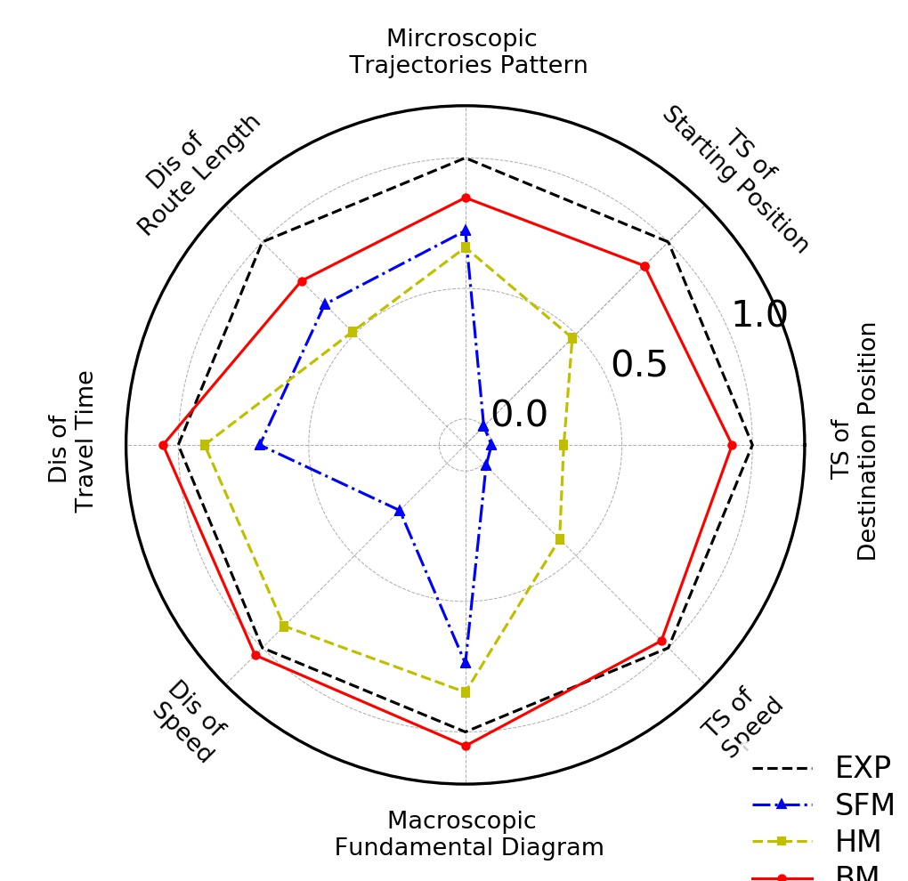

# Pedestrian-Model-Evaluation

Considering the fact that there is almost no general quatitative evaluation, calibration, and validation benchmark for pedestrian model, we introduce a pedestrian model evaluation framework based on trajectories from repeated experiments.

With this code, we formulate a framework for quantitatively evaluating a pedestrian model by comparing the trajectories in simulations and in experiments. 

We introduce four types of indexes here:
- macroscopic type (Fundamental diagram index)
- microscopic type (trajectories pattern index)
- static distribution indexes (i.e., route length distribution index, travel time distribution index speed distribution index)
- dynamic time-series index (i.e., starting position distance time-series index, destination position distance time-seiries index and speed time-series index). 

An improved dynamic time warping approach is applied, and a detailed calculation process can be found in the code. 

This work is feasible for different experiments and different simulations, hence the researchers can find a quantitative benchmark to evaluate, calibrate and validate pedestrian models.

All in all, YOU input the empirical and simulation trajectories, WE can output a radar figure and a score for the similarities.

